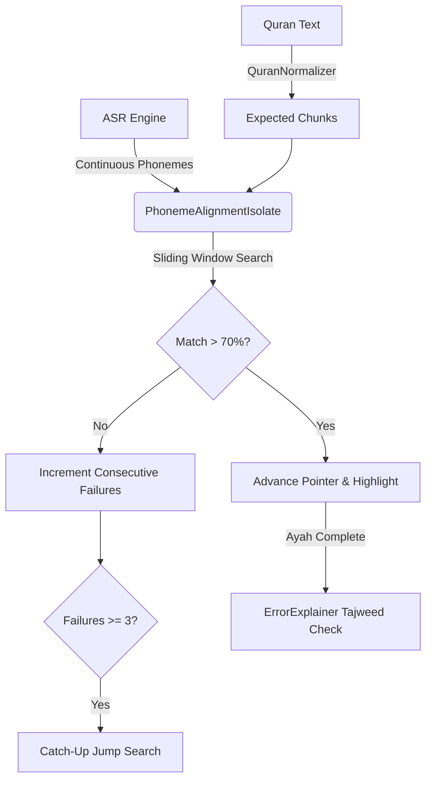

# Phonetic Matching Architecture & Word Tracking System

## Table of Contents
1. [Introduction](#1-introduction)
2. [The Core Challenge: Streaming Phonemes vs Distinct Words](#2-the-core-challenge-streaming-phonemes-vs-distinct-words)
3. [System Components](#3-system-components)
4. [Phonetic Normalization & Chunking](#4-phonetic-normalization--chunking)
5. [The Wagner-Fischer Levenshtein Isolate](#5-the-wagner-fischer-levenshtein-isolate)
6. [The Sliding Window Algorithm (Real-Time Tracking)](#6-the-sliding-window-algorithm-real-time-tracking)
7. [The Prior Penalty System (Preventing False Jumps)](#7-the-prior-penalty-system-preventing-false-jumps)
8. [The "Delete-0" Mechanism (Madd length handling)](#8-the-delete-0-mechanism-madd-length-handling)
9. [Smart Consecutive Failure & Catch-Up Search](#9-smart-consecutive-failure--catch-up-search)
10. [Integration with the Tajweed ErrorExplainer](#10-integration-with-the-tajweed-errorexplainer)

---

## 1. Introduction
This document serves as the master architectural reference for the ReciteQuran Phonetic Word Tracking system. 
The system is responsible for taking a continuous, space-less phonetic string from the Zipformer CTC ASR engine and perfectly mapping it, in real-time, to the exact Uthmani words of the Quran.

> [!NOTE]
> This document is written for both human maintainers and AI assistants (like Claude/Gemini) to quickly understand the nuances, edge-cases, and mathematical logic behind the matching system without having to blindly read thousands of lines of Dart code.

---

## 2. The Core Challenge: Streaming Phonemes vs Distinct Words
Unlike traditional Speech-to-Text APIs (like Google Speech or Whisper) which output distinct, space-separated words (`["بسم", "الله", "الرحمن"]`), the Zipformer CTC outputs a **continuous, low-level phonetic stream**: 
`"بسماللهالرحمنالرحيم"`

Furthermore, the ASR is prone to:
- **Hallucinations:** Outputting random phonemes during silence (e.g., `"بسماللهستعنالرحمن"`).
- **Stutters:** The user repeating words (e.g., `"بسمبسمالله"`).
- **Tail Corrections:** The ASR realizing a mistake 500ms later and backtracking to rewrite the end of the string.

### Why standard String Matching fails
If we tried `asrString.contains(expectedPhonemes)`, it would fail instantly if the ASR misheard a single vowel (e.g. `الرحيمُ` instead of `الرحيمِ`). 
If we used a standard global Levenshtein distance, a 5-word hallucination at the start of the Ayah would cause the entire Ayah's alignment to shift, associating the hallucinated text with actual Quranic words.

---

## 3. System Components
The architecture is split into three main layers:
1. **QuranNormalizer:** Converts Uthmani text into an expected sequence of Phonetic Chunks.
2. **PhonemeAlignmentIsolate:** A background Dart Isolate running high-speed matrix math (Wagner-Fischer) to constantly slide the expected chunks over the incoming ASR buffer.
3. **ErrorExplainer (Tajweed Checker):** A strictly separated system that runs *after* the word tracker finishes, checking the raw ASR for Tajweed rules.



---

## 4. Phonetic Normalization & Chunking
Arabic cannot be aligned character-by-character. The letter `ب` (Ba) and the Harakah `ِ` (Kasra) are two characters in Unicode (`\u0628\u0650`), but they represent a single phonetic sound (`Bi`). 

If we aligned characters individually, replacing `بِ` with `تَ` would cost 2 points (replace base, replace harakah).
Instead, `QuranNormalizer` uses Regex to group base letters and their residuals (Harakat, Sukun, Shaddah) into **Chunks**.
- `رَبِّ` -> chunks: `['رَ', 'ببِ']`
- `العالمين` -> chunks: `['ا', 'ل', 'عَ', 'اا', 'لَ', 'مِ', 'يي', 'نَ']`

> [!IMPORTANT]
> The Wagner-Fischer algorithm ONLY compares the **first character** of these chunks (the base consonant). This allows the tracker to instantly recognize `بِ` and `بُ` as a 0-cost perfect match, keeping the UI fast. The strict Harakat checking is deferred to the Tajweed `ErrorExplainer`.

---

## 5. The Wagner-Fischer Levenshtein Isolate
The core alignment is done via dynamic programming in `_alignPhonemeGroups()`.

### The Substitution Matrix (`_getCharSubCost`)
To make the tracker forgiving of minor ASR mistakes (without letting it jump to completely wrong words), certain base consonants are grouped together. Substituting them costs `0` instead of `1`.
- Nasals: `['ن', 'م']`
- Velar/Uvular: `['ق', 'ك']`
- Sibilants: `['ذ', 'ظ', 'ز', 'ض']`
- S/Th sounds: `['س', 'ص', 'ث']`
- T/D sounds: `['ت', 'ط', 'د']`

*(Note: Vowels `ا, و, ي` and Throat sounds `ع, ح, ه, خ` are strictly penalized to prevent catastrophic false matches).*

---

## 6. The Sliding Window Algorithm (Real-Time Tracking)
Because the `asrWindow` can grow indefinitely (filled with stutters or hallucinations), we cannot do a global Levenshtein alignment.

Instead, we take a **Target Window** (the next 15 expected chunks) and slide it across the `asrWindow`.
For every possible starting position (`startIdx += 3`), we compute the Levenshtein distance.

### The Algorithm:
1. Extract `targetWindow` from `expectedPhonemes`.
2. Map every chunk in `targetWindow` to a specific `Word ID`.
3. Slide `targetWindow` across `asrWindow` and calculate `tempAlignments`.
4. Count how many `equal` operations hit each `Word ID`.
5. Score = `(Equal Chunks) / (Total Chunks for that Word)`.
6. Pick the `startIdx` that yields the highest score.

---

## 7. The Prior Penalty System (Preventing False Jumps)
If the user says `"بسم الله"`, pauses, and the ASR outputs 30 chunks of garbage, the Sliding Window will search all 30 chunks.
If the window randomly finds a 30% match at `startIdx = 0`, but a 35% match at `startIdx = 20`, it would normally choose `startIdx = 20`. This causes the tracker to jump around wildly into hallucinated text.

**The Fix: The Prior Penalty**
We apply a mathematical penalty to the sliding window score based on how far it tries to jump.
```dart
double priorPenalty = startIdx * 0.02; // 2% penalty per chunk skipped
if (priorPenalty > 0.15) priorPenalty = 0.15; // Cap at 15%
double selectionScore = rawSim - priorPenalty;
```
By tethering the selection score to `startIdx = 0`, the tracker strongly prefers chronological text. It will only skip the 30 chunks of garbage if the match at `startIdx = 20` is overwhelmingly superior (beating the 15% penalty).

---

## 8. The "Delete-0" Mechanism (Madd length handling)
In Arabic, reciters can hold a Madd (vowel elongation) for 2, 4, or 6 counts. 
The Uthmani text might have 6 repeats of the Madd character (`ۦۦۦۦۦۦ`). If the user only says 2 (`ۦۦ`), standard Levenshtein would mark 4 deletions (massive penalty).

**The Old Bug:** We previously made deletions of repeated characters cost `0`, and counted them as `equal` matches. This caused a catastrophic bug where completely skipping a word with a long Madd gave it a 60% similarity score for free!

**The New `delete_0` Architecture:**
Instead of counting repeated character deletions as `equal`, we mark them as `delete_0`. 
When calculating the word score, we subtract `delete_0` operations from the `Word Total Chunk Count`.
- Target: `['م', 'م', 'م']` (Total = 3)
- Spoken: `['م']` (Equals = 1, `delete_0` = 2)
- Score = `1 / (3 - 2) = 1 / 1 = 100%`.
This mathematically solves Madd lengths without inflating the score of skipped words.

---

## 9. Smart Consecutive Failure & Catch-Up Search
When the user completely skips a word, the Sliding Window will fail (Similarity < 70%).
Previously, the tracker would immediately launch a heavy "Catch-Up Search" (looking 6 words ahead in the Quran) every 5 milliseconds, spamming the CPU and causing panic-jumping.

**The State Machine:**
We track `consecutiveFailures`. 
If `similarity < 70%`, we increment `consecutiveFailures`.
The heavy Catch-up search is ONLY allowed to run if `consecutiveFailures >= 3`.

**Catch-Up Jump Penalty:**
To prevent the catch-up search from randomly matching a word 3 ayahs ahead, it calculates how many *Expected Words* it is skipping.
```dart
int wordsSkipped = actualWordAtCatchup - expectedWordAtCatchup;
double jumpPenalty = wordsSkipped * 0.10; 
if (jumpPenalty > 0.25) jumpPenalty = 0.25;
double catchupScore = rawSim - jumpPenalty;
```
If it attempts to skip 2 words, it must overcome a 20% penalty. A 70% match becomes 50% and fails. It now requires a 90% (near-perfect) phonetic match to successfully jump, completely destroying false positives.

---

## 10. Integration with the Tajweed ErrorExplainer
The most critical architectural decision is **Separation of Duties**.

The `PhonemeAlignmentIsolate` is a forgiving, high-speed UI tracker. It ignores Harakat, forgives stutters, and skips garbage.
When the Ayah finishes, it packages the **FULL, RAW ASR BUFFER** (including all stutters, wrong Harakat, and extra words) and sends it to the main thread:
`mainSendPort.send({'event': 'ayah_completed', 'raw_asr': asrWindow});`

The `ErrorExplainer` (running on the main thread) takes this raw string and runs a strict, character-by-character Tajweed analysis. 
Because the isolate did not filter the string, the `ErrorExplainer` correctly sees that the user said `"بسم الله مالك الرحمن"` and flags `"مالك"` as an `Insertion` error, highlighting it in red for the user.

*(End of Architecture Document)*
